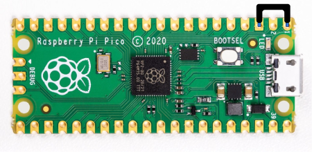
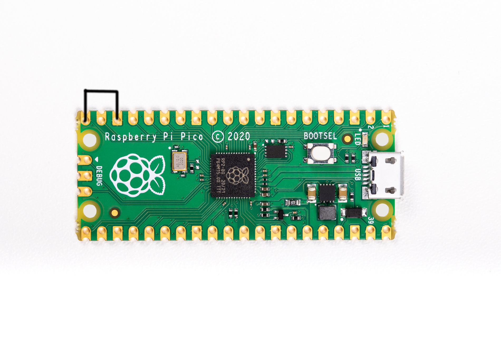

<h1 align="center">Raspberry Pi Pico To Bad USB Converter</h1>

<div align="center">
  <strong>Make A Cheap But Powerful USB Rubber Ducky With A Raspberry Pi Pico</strong>
</div>

<br />

<div align="center">
  
  
  
  
</div>

<br />

## Install

Install and have your USB Rubber Ducky working in less than 5 minutes.
1. Clone This Ripo Or Download Zip By Clicking [Here](https://github.com/OCEANOFANYTHINGOFFICIAL/RPI-PICO-TO-BAD-USB-CONVERTER/archive/refs/heads/main.zip) And Unzip It

2. Download [CircuitPython for the Raspberry Pi Pico](https://circuitpython.org/board/raspberry_pi_pico/).  And Rename It To `firmware.uf2` And Paste It Into Cloned/Unzipped Repo Folder With Replacing The Previous One
3. Run The `Run.bat` File
4. And Thats It .
### Setup Mode

To edit the payload, enter setup mode by connecting the pin 1 (`GP0`) to pin 3 (`GND`), this will stop the pico-ducky from injecting the payload in your own machine.
The easiest way to so is by using a jumper wire between those pins as seen bellow.



### USB enable/disable mode

If you need the pico-ducky to not show up as a USB mass storage device for stealth, follow these instructions.  
Enter setup mode.  
Connect a jumper wire between pin 18 and pin 20.
This will prevent the RPI-PICO-BAD-USB from showing up as a USB drive when plugged into the target computer.  
Remove the jumper and reconnect to your PC to reprogram.
The default mode is USB mass storage enabled.   



### Changing Keyboard Layouts

Copied from [Neradoc/Circuitpython_Keyboard_Layouts](https://github.com/Neradoc/Circuitpython_Keyboard_Layouts/blob/main/PICODUCKY.md)  

#### How to use one of these layouts with the pico-ducky repository.

**Go to the [latest release page](https://github.com/Neradoc/Circuitpython_Keyboard_Layouts/releases/latest), look if your language is in the list.**

#### If your language/layout is in the bundle

Download the `py` zip, named `circuitpython-keyboard-layouts-py-XXXXXXXX.zip`

**NOTE: You can use the mpy version targetting the version of Circuitpython that is on the device, but on Raspberry Pi Pico you don't need it - they only reduce file size and memory use on load, which the pico has plenty of.**

#### If your language/layout is not in the bundle

Try the online generator, it should get you a zip file with the bundles for yout language

https://www.neradoc.me/layouts/

#### Now you have a zip file

#### Find your language/layout in the lib directory

For a language `LANG`, copy the following files from the zip's `lib` folder to the `lib` directory of the board.  
**DO NOT** modify the adafruit_hid directory. Your files go directly in `lib`.  
**DO NOT** change the names or extensions of the files. Just pick the right ones.  
Replace `LANG` with the letters for your language of choice.

- `keyboard_layout_win_LANG.py`
- `keycode_win_LANG.py`

Don't forget to get [the adafruit_hid library](https://github.com/adafruit/Adafruit_CircuitPython_HID/releases/latest).

This is what it should look like **if your language is French for example**.


#### Modify the pico-ducky code to use your language file:

At the start of the file comment out these lines:

```py
from adafruit_hid.keyboard_layout_us import KeyboardLayoutUS as KeyboardLayout
from adafruit_hid.keycode import Keycode
```

Uncomment these lines:  
*Replace `LANG` with the letters for your language of choice. The name must match the file (without the py or mpy extension).*
```py
from keyboard_layout_win_LANG import KeyboardLayout
from keycode_win_LANG import Keycode
```

## Useful links and resources

### Docs

[CircuitPython](https://circuitpython.readthedocs.io/en/6.3.x/README.html)

[CircuitPython HID](https://learn.adafruit.com/circuitpython-essentials/circuitpython-hid-keyboard-and-mouse)

[Ducky Script](https://github.com/hak5darren/USB-Rubber-Ducky/wiki/Duckyscript)

### Video tutorials

[pico-ducky tutorial by **NetworkChuck**](https://www.youtube.com/watch?v=e_f9p-_JWZw)

[USB Rubber Ducky playlist by **Hak5**](https://www.youtube.com/playlist?list=PLW5y1tjAOzI0YaJslcjcI4zKI366tMBYk)

[CircuitPython tutorial on the Raspberry Pi Pico by **DroneBot Workshop**](https://www.youtube.com/watch?v=07vG-_CcDG0)
