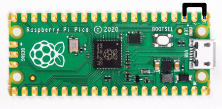
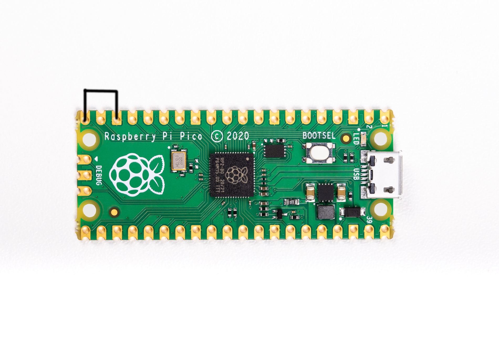
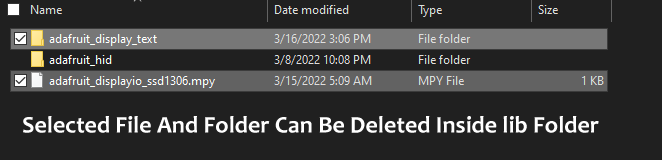
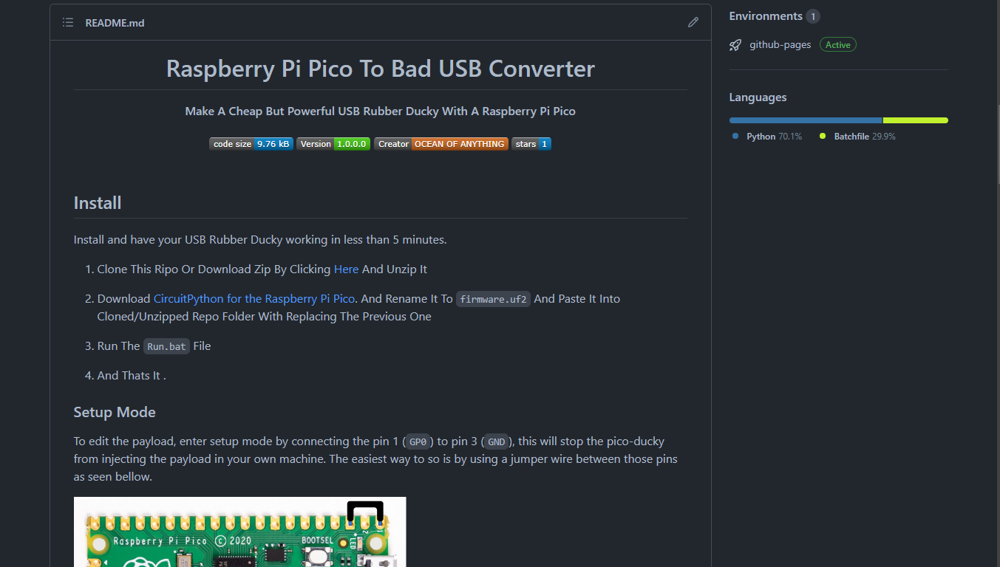

<h1 align="center">Raspberry Pi Pico To Bad USB Converter</h1>

<div align="center">
  <strong>Make A Cheap But Powerful USB Rubber Ducky With A Raspberry Pi Pico</strong>
</div>

<br />

<div align="center">
  
  
  
  
</div>

<br />

## Install

Install and have your USB Rubber Ducky working in less than 5 minutes.
1. Clone This Ripo Or Download Zip By Clicking [Here](https://github.com/OCEANOFANYTHINGOFFICIAL/RPI-PICO-TO-BAD-USB-CONVERTER/archive/refs/heads/main.zip) And Unzip It

2. Download [CircuitPython for the Raspberry Pi Pico](https://circuitpython.org/board/raspberry_pi_pico/).  And Rename It To `firmware.uf2` And Paste It Into Cloned/Unzipped Repo Folder With Replacing The Previous One
3. Run The `Run.bat` File
4. And Thats It .
### Setup Mode

To edit the payload, enter setup mode by connecting the pin 1 (`GP0`) to pin 3 (`GND`), this will stop the pico-ducky from injecting the payload in your own machine.
The easiest way to so is by using a jumper wire between those pins as seen bellow.



### USB enable/disable mode

If you need the pico-ducky to not show up as a USB mass storage device for stealth, follow these instructions.  
Enter setup mode.  
Connect a jumper wire between `pin 18 (GND)`  and `pin 20 (GP15)`.
This will prevent the RPI-PICO-BAD-USB from showing up as a USB drive when plugged into the target computer.  
Remove the jumper and reconnect to your PC to reprogram.
The default mode is USB mass storage enabled.   



### Usage

There Is A File Named `payload.dd` In Your `Raspberry Pi Pico ` After Configuring That Into Bad USB. You Can Edit That File And Write Your Payload Script Code In That. You Also Dont Need To Compile Or Encode To Use The Original Code. You Can Actually Run That Directly !

> ProTip!
> 
> You Can Run Different Payloads By Configuring One Time !

It Means You Can Save Multiple Payload Files And Can Run That. You Can't Run Different Payloads Or All Payloads At One Time. Please Read The Limitations
#### limitations To Run Multiple Payloads

 - You Can Save Four Different Payloads 
 - Only Four Different Payloads
 - Can Run One At A Time
 - Can't Run Multiple Payloads At One Time
 - You Can Use Buttons Or Jumper Wire To Run Those Different Payloads
 - Default Is `payload.dd` And You Can Add `payload2.dd`, `payload3.dd`, `payload4.dd`
 - You Have To Connect Buttons in Following Steps,-
> - payload2 = GPIO5 to GND
>  - payload3 = GPIO10 to GND
>  - payload4 = GPIO11 to GND
- To Run Each Script, Press And Hold The Payload's Coresponding Button And Then Insert The `Bad USB` Into Victim's PC

### Changing Keyboard Layouts

Copied from [Neradoc/Circuitpython_Keyboard_Layouts](https://github.com/Neradoc/Circuitpython_Keyboard_Layouts/blob/main/PICODUCKY.md)  

#### How to use one of these layouts with the pico-ducky repository.

**Go to the [latest release page](https://github.com/Neradoc/Circuitpython_Keyboard_Layouts/releases/latest), look if your language is in the list.**

#### If your language/layout is in the bundle

Download the `py` zip, named `circuitpython-keyboard-layouts-py-XXXXXXXX.zip`

**NOTE: You can use the mpy version targetting the version of Circuitpython that is on the device, but on Raspberry Pi Pico you don't need it - they only reduce file size and memory use on load, which the pico has plenty of.**

#### If your language/layout is not in the bundle

Try the online generator, it should get you a zip file with the bundles for yout language

https://www.neradoc.me/layouts/

#### Now you have a zip file

#### Find your language/layout in the lib directory

For a language `LANG`, copy the following files from the zip's `lib` folder to the `lib` directory of the board.  
**DO NOT** modify the adafruit_hid directory. Your files go directly in `lib`.  
**DO NOT** change the names or extensions of the files. Just pick the right ones.  
Replace `LANG` with the letters for your language of choice.

- `keyboard_layout_win_LANG.py`
- `keycode_win_LANG.py`

Don't forget to get [the adafruit_hid library](https://github.com/adafruit/Adafruit_CircuitPython_HID/releases/latest).

This is what it should look like **if your language is French for example**.


#### Modify the pico-ducky code to use your language file:

At the start of the file comment out these lines:

```py
from adafruit_hid.keyboard_layout_us import KeyboardLayoutUS as KeyboardLayout
from adafruit_hid.keycode import Keycode
```

Uncomment these lines:  
*Replace `LANG` with the letters for your language of choice. The name must match the file (without the py or mpy extension).*
```py
from keyboard_layout_win_LANG import KeyboardLayout
from keycode_win_LANG import Keycode
```

## Useful links and resources

### Docs

[CircuitPython](https://circuitpython.readthedocs.io/en/6.3.x/README.html)

[CircuitPython HID](https://learn.adafruit.com/circuitpython-essentials/circuitpython-hid-keyboard-and-mouse)

[Ducky Script](https://github.com/hak5darren/USB-Rubber-Ducky/wiki/Duckyscript)
# Changelog

 1. You Can Use Display
 2. Drive Name Will Not `CIRCUITPY`, It Will Be `RUBBER DUCK`
 3. Faster Code Execution
 4. Splash Screen On Display
 5. Cpu Temp On Display
 6. Elapsed Or Spend Time On Display
 7. Payload Name On Display
 8. Optimized Payload Convert
 9. No Longer Need To Use `Autorun.inf` File
 10. Bug aAnd Lag Fix ( Over Heating, LED Not Blinking, USB Not Recognizing) 

## Use ***`i2c OLED Display`***  Display
In This New Update You Can Use A ***`i2c OLED Display`*** With The ***`Raspberry Pi Pico`***. This Will Show Cpu Temperature Of Pico, Payload Name And Time Spend To Run The Script On The Display. Overall This Is Not A Very Big Feature But It Looks Cool, So Try To Use It

### Display Types
There are 2 types of OLED displays Available In The Market, The `SSD1306` and the `SH1106`.


But Only One Of Them Can Be Used For This Project. That Is  ***`SSD1306`***. You Can't Use The ***~~SH1106~~*** Display

The Image Bellow Is `SSD1306` The Correct One


And They Sometimes Come With Either `I2C` or `SPI`. 


But We Need Only ***`I2C`***. Not The ~~***SPI***~~


### Connections
|Display| GPIO |
|--|--|
| GND | GND |
| VCC/VDD | VCC / 3.3V |
| SCL/CLK/SCK | GP 21 |
| SDA | GP 20 |
### Drawbacks
This `Display` Feature Has Also Some Drawbacks.

 1. The Size Of Code Is Increased
 2.  More Libraries Are Included, For That The Size Of The `lib` File Is Increased
 3. More Power Consumption
 
 ### This Feature Is Optional
 If You Don't Have A Display Or You Don't Want To Use a Display With Your Raspberry Pi Pico, Then Don't Use. This Is Not Necessary And Completely Optional Step.
 
 You Can Run This Project Without Using A Display. To Do So, You Have To Follow The Steps Bellow Or Don't Do Anything. The Display Code Will Be SkIpped Automatically . But If You Want A Smaller Code The Just Follow These Steps:
 
 1. First You Can Delete Unused Libraries Form The `lib` Folder. You Can Delete `adafruit_displayio_ssd1306.mpy` File And  `adafruit_display_text` Folder. These Folder And File Contains Display Libs That Is Used to Run The Display Code. Example Given In The Image Bellow:
 


2. Or You Can Use `v1.0.0.1` Of **`RPI-PICO-TO-BAD-USB-CONVERTER`**. Because This Is The Most Stable And Minimal Version Of This Project. It Dosn't Contain And Display Code And Neither Any Extra Library. So This Will Be Perfect For You If You Don't Want To Use Any Display



3. Do Nothing. Yah! You Heard It Right. Do Noting, You Dont Have To Delete, Change And Install Anything. The Code Will Automatically Handle The Process. If You Are A Noob, Oops Sorry! If You Are Not An Advance User, This Step Is Perfect For You. Just Take A Shot And Enjoy Your Life .
# Creator
## This Project Is Officially Created, Hosted And Maintained By Nakshatra Ranjan Saha (OCEAN OF ANYTHING).

If You Want To Contact Me Then Use 
## Email : [oceanofanything@gmail.com](mailto:oceanofanything@gmail.com)
## Phone: [+91 8902 1094 55](tel:+918902109455)
